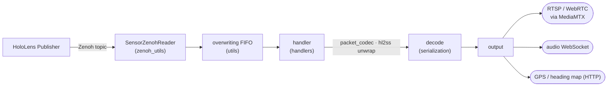

# HoloLens Subscriber Examples

Subscriber-side reference implementations that consume HoloLens sensor streams
published over **Zenoh** (see the corresponding HoloLens Publisher repository).
Each stream has a handler that decodes it and re-exposes it in a useful form, for example: 
video over RTSP, audio over WebSocket, or a live GPS/heading map.

Part of the **SafeXCity** project. Author: **Rodrigo Abreu**.

## Architecture

Each handler runs as its own process. Which handlers start is driven by the
`[sensors]` list in `configs/app_config.ini`; `src/factory.py` maps each name to a
handler class.



## Repository layout

```
src/
├── handlers/        one subscriber per stream (RGB, depth, VLC, audio, GPS, heading, map, …)
├── zenoh_utils/     Zenoh subscriber → FIFO
├── serialization/   wire decode (packet_codec, hl2ss unwrap)
├── utils/           keep-latest FIFOs, RTSP video out, FastAPI, config
├── factory.py       name → handler
└── main.py          entrypoint (supervises the configured handlers)
configs/app_config.ini
docs/                architecture, configuration, topic/packet contract
```

## Components (details in each subfolder)

| Area | What it does |
|------|--------------|
| [`src/handlers`](src/handlers) | one subscriber per stream |
| [`src/zenoh_utils`](src/zenoh_utils) | receive raw packets off Zenoh |
| [`src/serialization`](src/serialization) | decode the wire format |
| [`src/utils`](src/utils) | buffers, RTSP video output, web, config |

## Quick start

Start a publisher first, then:
```bash
./run-subscriber.sh                       # docker compose up
docker compose up --build                 # first run / after changes
```

## Configuration

Enabled subscribers and per-stream settings live in `configs/app_config.ini`
(`[sensors]` list + one section per stream). See
[docs/configurations.md](docs/configurations.md).

## Output endpoints (defaults)

| Stream | URL |
|--------|-----|
| RGB (PV) | `rtsp://localhost:8554/pv_camera` (WebRTC: `http://localhost:8889/pv_camera/`) |
| Depth | `rtsp://localhost:8554/depth_camera` |
| VLC (l/r) | `rtsp://localhost:8554/vlc_camera_*` |
| GPS + heading map | `http://localhost:8797/` |
| Audio (WebSocket) | `ws://localhost:4000/audio` |
| Prometheus metrics | `http://localhost:8686/` |

Video handlers encode with **PyAV** and push to a local **MediaMTX** server over
RTSP, which re-exposes each stream as RTSP / WebRTC / HLS.

## Dependencies and privacy

The `libs/hololens_sensor_streaming` git submodule supplies the project's
`hl2ss` decoder and is pinned to a public upstream revision. Initialize it with:

```bash
git submodule update --init --recursive
```

The upstream `hl2ss` license includes a Commons Clause restriction. Review and
preserve its license terms; it is a separate dependency and is not covered by
any license you choose for this repository.

The checked-in configuration contains only loopback addresses and example topic
names. This application can handle live camera, microphone, GPS, and orientation
data; do not commit recordings, logs, packet captures, or exported telemetry.
The map, audio, metrics, and MediaMTX endpoints have no authentication and bind
to loopback in the checked-in configuration. Keep them local or place them
behind an access-controlled proxy if you deliberately expose them.

## Docs

[`docs/`](docs) — [architecture](docs/architecture.md),
[configuration](docs/configurations.md),
[topic/packet contract](docs/topic-packet-contract.md).
