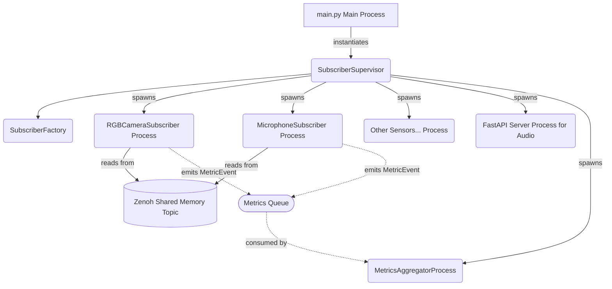
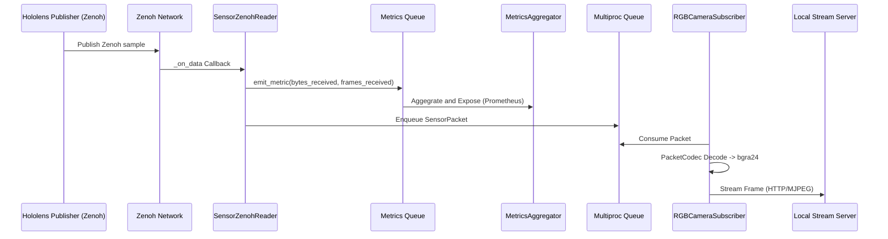

# Architecture

The Hololens Subscribers Example application consumes sensor data published over Zenoh by the Hololens Publisher. The architecture mirrors the publisher for consistency, utilizing a centralized runtime supervisor to manage parallel worker processes for each sensor type.

## Core Components

- **`main.py` (Composition Root):** Loads configuration, configures logging, and initializes the `SubscriberSupervisor`.
- **`SubscriberSupervisor`:** An orchestrator pattern (`src/runtime/supervisor.py`) that interprets the configuration and ensures that all selected sensor subscriber processes are spawned and monitored. It handles graceful restarts if a subscriber crashes and coordinates shutdown.
- **`MetricsAggregatorProcess`:** Consumes standard `MetricEvent` objects from a shared multiprocessing `metrics_bus`. It maintains a rolling aggregation of frame and byte rates and exposes a Prometheus endpoint. The checked-in configuration uses port 8686; `AppConfig` uses 8000 when no config file overrides it.
- **`SubscriberFactory`:** Constructs specific subscriber process instances (`RGBCameraSubscriber`, `MicrophoneSubscriber`, etc.) based on standard definitions in `sensors_config.ini`. Base implementations reside in `src/handlers/`.
- **Zenoh Subscription (`SensorZenohReader`):** Subscribers use a common `SensorZenohReader`. Its callback materializes each Zenoh payload as `bytes` and places it on a multiprocessing queue. The publisher can optionally use Zenoh shared memory, but this subscriber path is not end-to-end zero-copy; shared-memory support also requires compatible Zenoh configuration and host IPC setup.

## Process Tree

Below is the logical hierarchy of processes when the supervisor starts:

## Data Flow

Sensors publish data to Zenoh. The subscribers receive the bytes and deserialize them. Here is a high level data flow of a camera subscriber:

## Resilience and Restarts
The `SubscriberSupervisor` provides resilience by employing a polling loop that inspects the health of each child process via its `.is_alive()` status. When a child dies abruptly, the supervisor attempts up to `restart_max_attempts` sequential restarts with backoff. If the limit is hit, the supervisor will leave the dead process permanently tombstoned while the rest of the application runs undisturbed.

## Network and data handling

The HTTP, WebSocket, RTSP, WebRTC, and Prometheus services do not authenticate
callers. The checked-in defaults bind them to loopback; keep those bindings or
use a firewall/access-controlled reverse proxy if you deliberately expose live
location, camera, or microphone data. Never commit captured sensor data.
