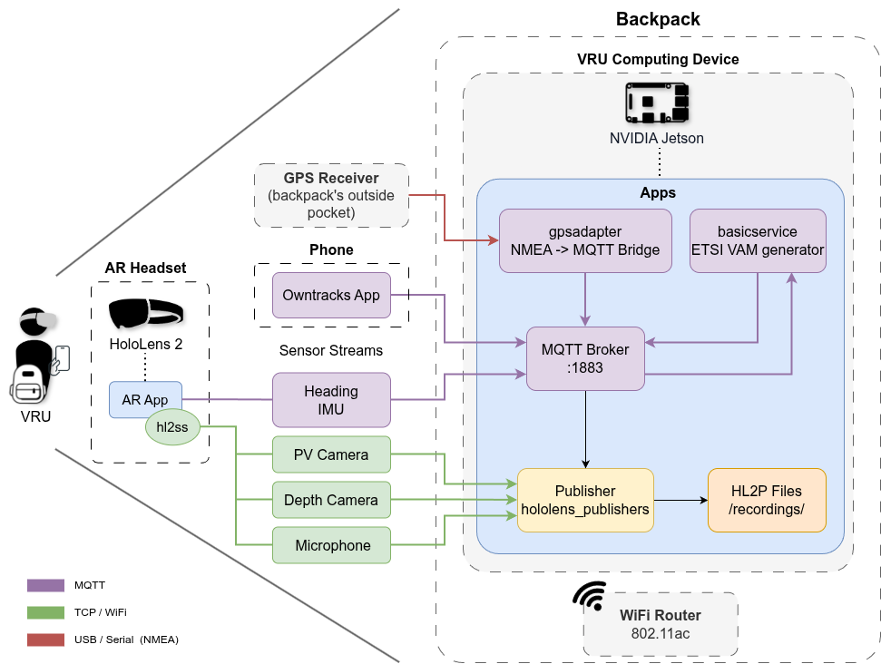
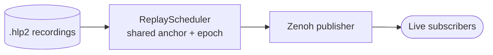
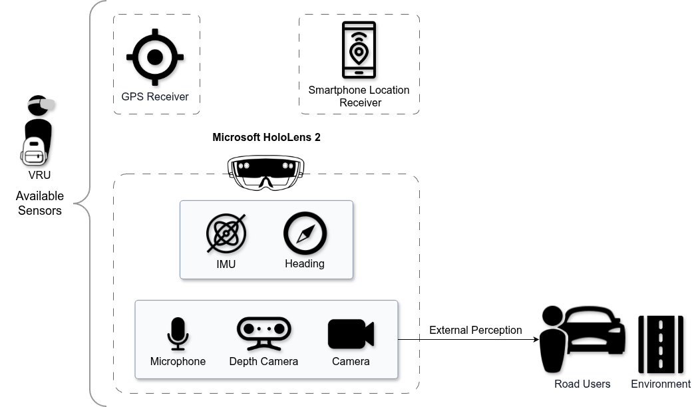

# HoloLens Publisher

Captures the mobile sensor streams: HoloLens 2 (RGB / depth / audio / IMU via `hl2ss`) plus MQTT-delivered GPS and heading. It wraps each sample in a canonical **`SensorEnvelope`**/ **`SensorSample`**, and **records** it to disk and/or **publishes** it to **Zenoh** for live consumers. It also **replays** recordings back onto Zenoh in real time (simulation mode).

## Architecture

A HoloLens 2 (streaming over `hl2ss`), a USB GPS receiver, and a phone ride with the VRU wearer. A backpack **Jetson** runs the apps. GPS (NMEA→MQTT via `gpsadapter`), the ETSI VAM generator (`basicservice`), phone location, and the HoloLens heading/IMU all reach an on-device **MQTT broker**, while the HoloLens video/audio streams arrive over TCP/Wi‑Fi.



Internally the `app` runs one supervised process per stream (plus dedicated **health** and **metrics** processes). The HoloLens streamer drives a **sink manager** over the `hl2ss` streams/sinks.

Three **modes** select the sinks: **live** (Zenoh only), **record** (also writes `.hlp2`), **simulation** (replay recordings). Simulation plays the recorded streams back onto Zenoh at real time, all on one shared timeline (see [`src/sync`](src/sync)):



## Sensor streams

The publisher can capture the full HoloLens 2 research sensor set plus external GPS/orientation delivered over MQTT.



**HoloLens 2 (via `hl2ss`)**

| Stream | Zenoh topic | In dataset |
|--------|-------------|:----------:|
| RGB (PV) camera | `Hololens/RGBCamera` | ✓ |
| Depth — long-throw / AHAT | `Hololens/DepthCamera` | ✓ |
| Microphone (audio) | `Hololens/Microphone` | ✓ |
| VLC grayscale cameras ×4 | `Hololens/VLC` | — |
| RM IMU — accelerometer | `Hololens/IMU/Accelerometer` | — |
| RM IMU — gyroscope | `Hololens/IMU/Gyroscope` | — |
| RM IMU — magnetometer | `Hololens/IMU/Magnetometer` | — |
| Eye tracking (EET) | `Hololens/EET` | — |
| Spatial input (hand / head) | `Hololens/SpatialInput` | — |

**External — delivered over MQTT, re-published to Zenoh**

| Stream | Zenoh topic | In dataset |
|--------|-------------|:----------:|
| VAM GPS (ETSI / cabasicservice) | `Hololens/VamLocation` | ✓ |
| Phone GPS (OwnTracks) | `Hololens/PhoneLocation` | ✓ |
| Unity heading | `Hololens/Heading` | ✓ |
| Unity IMU — yaw / pitch / roll | `Hololens/UnityIMU` | ✓ |

HoloLens streams are configured per-sensor in `configs/sensors_config.ini`. The MQTT streams are handled by the corresponding sensor processes. Note the dataset's orientation comes from the **Unity IMU** (MQTT), distinct from the HoloLens **RM
IMU** listed above.

## Repository layout

```
src/
├── hololens/        HoloLens capture adapter (hl2ss boundary)
├── mqtt/            MQTT GPS / heading / IMU parsing
├── processes/       one worker process per stream (+ health, metrics)
├── publish/         Zenoh publishing
├── serialization/   SensorEnvelope codecs (file + Zenoh)
├── storage/         .hlp2 recording & playback
├── sync/            real-time replay pacing & cross-stream sync
├── config/          config center (file < env < cli)
├── contracts/       SensorEnvelope / event types
├── runtime/         process supervision & lifecycle
└── observability/   metrics emission
configs/             app_config.ini · sensors_config.ini
assets/              README diagrams
```

## Components (details in each subfolder)

| Area | What it does |
|------|--------------|
| [`src/hololens`](src/hololens) | HoloLens `hl2ss` capture boundary |
| [`src/mqtt`](src/mqtt) | parse VAM/phone GPS, Unity heading/IMU |
| [`src/processes`](src/processes) | per-stream capture/record/publish + replay |
| [`src/publish`](src/publish) | Zenoh session, topic routing |
| [`src/serialization`](src/serialization) | envelope framing for file & wire |
| [`src/storage`](src/storage) | `.hlp2` recorder / reader / manifest |
| [`src/sync`](src/sync) | replay scheduler + shared-timeline anchor |

## Run

Interactive wizard:
```bash
./run-publisher.sh
```

Non-interactive (env vars):
```bash
SETTINGS_MODE=record ZENOH_ENABLED=true ZENOH_USE_SHM=false HOST_DIR=./recordings ./run-publisher.sh
```
`SETTINGS_MODE` = `live` | `record` | `simulation`. This launches the publisher
via Docker Compose. Direct Python entrypoint:
```bash
python3 -m src.main --config configs/app_config.ini --sensor-config-file configs/sensors_config.ini
```

## Configuration

Config center resolves **file < env < cli**. Sources: `configs/app_config.ini` (settings), `configs/sensors_config.ini` (enabled streams).

The checked-in INI files contain loopback addresses and empty credentials only. To start, set the environment variables `HOLOLENS_ADDRESS`, `MQTT_HOST`, `MQTT_USERNAME`, and `MQTT_PASSWORD` (or the equivalent CLI options) in your deployment environment. The local Mosquitto example is intentionally bound to loopback and permits anonymous access for development.
